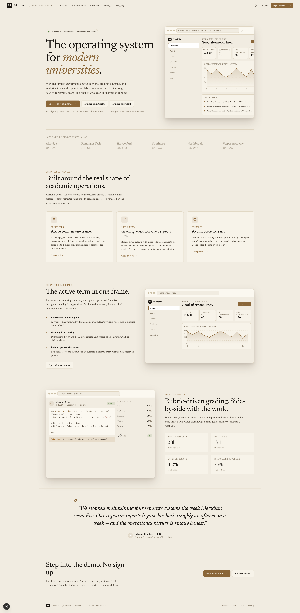
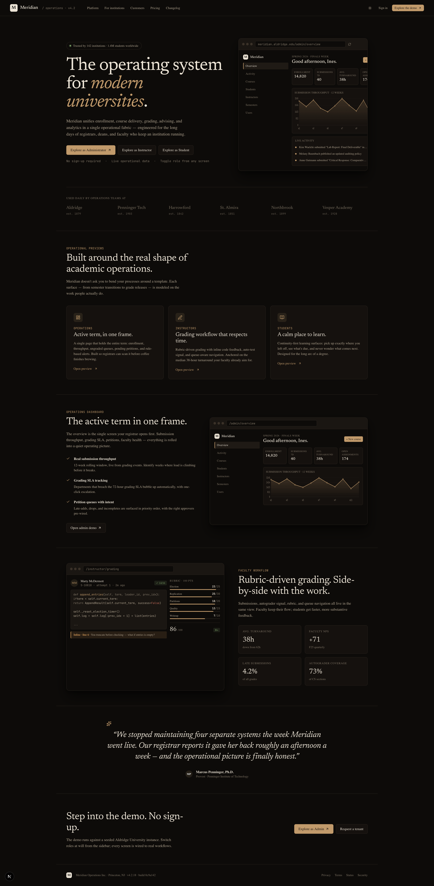
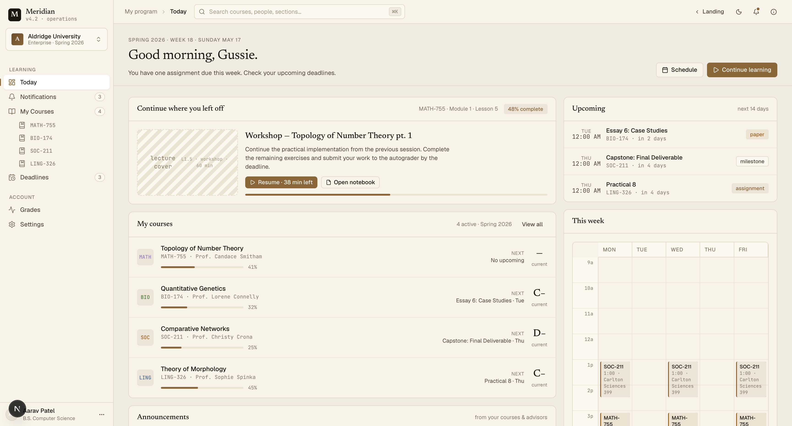
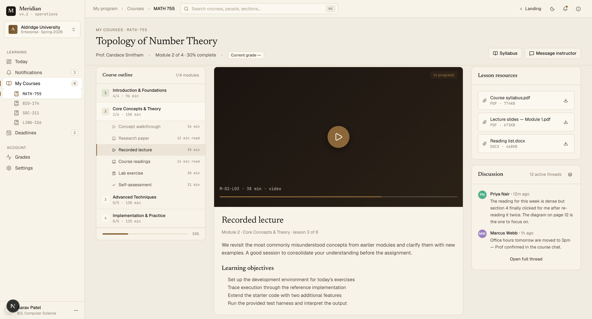
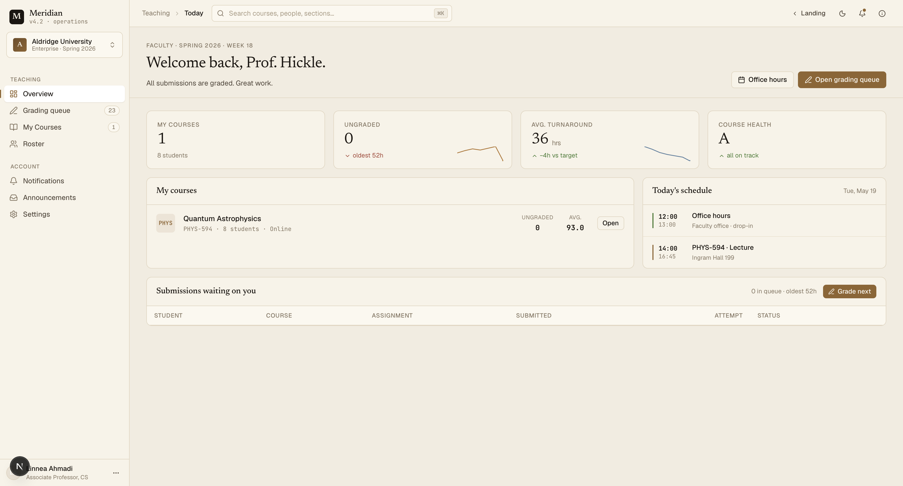
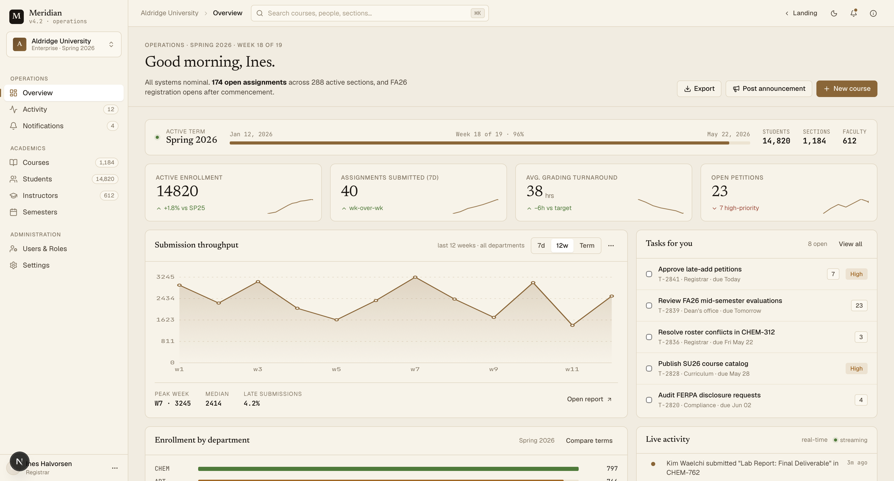
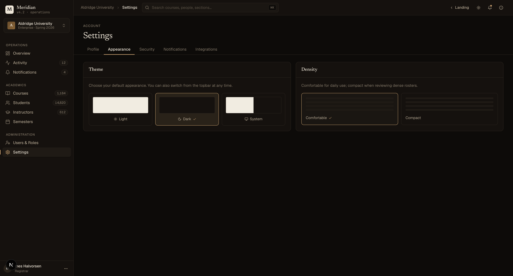

# Meridian

**The operating system for modern universities.**

Meridian is a full-stack LMS built to demonstrate what production-quality frontend engineering looks like at institutional scale — not a CRUD app dressed in a dashboard, but a system with genuine operational complexity: multi-role access models, relational data dependencies, a hand-built design system, and ~30 screens that behave the way real software should.

---

## Product Vision

Most portfolio LMS projects are feature-lists masquerading as products. Meridian is built around a different premise: **institutional software is hard because it serves radically different users simultaneously**.

A registrar managing semester configuration has nothing in common with a professor grading a submission queue at 11pm, who has nothing in common with a student trying to understand why their grade dropped. Each role has its own information hierarchy, its own workflows, its own relationship to urgency. Building all three — with shared infrastructure but divergent UX — is the actual challenge.

Meridian treats this as an architecture problem, not a styling problem.

---

## Screenshots

**Landing Page**




**Student Portal**




**Instructor Portal**



**Admin Portal**


---

## Live Demo

<a href="https://meridian-university.vercel.app">Live Demo</a>

One-click demo personas on the login page — no account required. Sign in as an admin, instructor, or student to explore each portal independently.

---

## Architecture Highlights

### Server / Client Boundary as a Design Constraint

Every route follows the same contract: a **server component** fetches and shapes data, a **client component** owns interactivity. No client-side data fetching. No loading waterfalls inside components. The boundary is enforced by `server-only` imports in the data layer — if a client component accidentally imports from the fake-db, the build fails.

This pattern makes the data layer swappable. Point the server components at a real API and nothing in the component tree changes.

### Deterministic Relational Data Universe

The fake-db (`src/fake-db/`) is not a bag of random fixtures. It's a seeded, relational data model:

- Courses have enrolled students and assigned instructors
- Deadlines belong to courses, typed by assessment category
- Grading queue items reference specific students and submissions
- Dashboard aggregates (enrollment counts, grade distributions, attendance rates) are derived from the same underlying records

The consequence: navigating from the admin's course detail to an instructor's grading queue to a student's deadline view produces consistent data. Nothing is mocked in isolation.

### Role-Based Architecture Without Code Duplication

Three portals — `admin/`, `instructor/`, `student/` — share a single authenticated shell (`(app)/layout.tsx`) but diverge completely in navigation, data contracts, and interaction patterns. The shell receives role-agnostic props; each portal's page components are responsible for their own data shape.

The command palette (⌘K) is an example of this: the same `CommandPalette` component renders a different index depending on which role is active, built server-side and passed as a serializable prop to avoid the `server-only` boundary.

---

## Design System

Meridian has no Tailwind utility classes in JSX. Every visual decision lives in `src/styles/` as plain CSS with `--m-*` custom properties.

**Why this choice matters:** utility-first CSS scales poorly as a design system. When every component assembles its own visual rules from atomic classes, there is no single source of truth for what a "card" looks like, what the hover state of a navigation item is, or how dense the layout should feel. Meridian's design system is a set of named, intentional decisions — `.m-card`, `.m-nav__item--active`, `.m-btn--primary` — that can be updated globally and reasoned about independently of component logic.

The token layer uses CSS custom properties scoped to `[data-theme]` attributes, giving full dark/light support without a single conditional in component code. Theme switching writes a cookie server-side; the `<html>` element gets the correct `data-theme` before paint, with no flash.

The typography system uses three deliberate typefaces: **Newsreader** (a warmly humanist serif) for display text, **Geist Sans** for UI, and **JetBrains Mono** for data. The palette is warm institutional — amber-tan accents against deep brown-black in dark mode, parchment and earth tones in light — chosen to feel like a place of learning rather than a SaaS dashboard.

---

## Multi-Role Architecture

| Role           | Primary workflow                     | Key screens                                                   |
| -------------- | ------------------------------------ | ------------------------------------------------------------- |
| **Admin**      | Institution oversight, configuration | Overview, Courses, Instructors, Students, Semesters, Activity |
| **Instructor** | Teaching, assessment, communication  | Dashboard, Grading, Roster, Announcements, Courses            |
| **Student**    | Learning, tracking, planning         | Dashboard, Courses, Deadlines, Grades                         |

Each portal has its own sidebar navigation, its own data queries, and its own empty states. A student seeing no deadlines gets a different message than an instructor with nothing in their grading queue. These are different emotional contexts.

---

## Design Decisions

**Custom design system over a component library** — The goal was to build a coherent visual language from first principles: token hierarchy, spacing rhythm, type scale, state semantics. Assembling from shadcn components alone wouldn't demonstrate that capability. Shadcn/Radix UI is used where appropriate for accessible primitives (popovers, calendars, date pickers); the visual layer on top is entirely custom.

**Relational fake-db over static fixtures** — Static JSON fixtures are a trap. They look realistic in screenshots but break the moment you navigate across screens. A seeded, relational data layer means every number on a dashboard is derivable from the records it claims to summarize.

**No client-side fetching** — Every page is a server component + client component pair. This keeps data concerns at the edge, makes the client bundle smaller, and means the component layer never has to reason about loading, error, or stale states for the initial render.

**Deterministic seeding** — Faker.js is seeded with a fixed value so the data universe is stable across builds. Developers see the same data every time; nothing flickers between hard refreshes.

---

## Tech Stack

|            |                                                                             |
| ---------- | --------------------------------------------------------------------------- |
| Framework  | Next.js 16 (App Router)                                                     |
| Language   | TypeScript 5, strict mode                                                   |
| Styling    | Plain CSS + `--m-*` custom properties, Tailwind CSS v4 for layout utilities |
| Primitives | Radix UI, shadcn                                                            |
| Icons      | Lucide React                                                                |
| Mock data  | Faker.js (seeded) with relational generators                                |
| Fonts      | Newsreader, Geist Sans, JetBrains Mono (via `next/font`)                    |

---

## Getting Started

```bash
npm install
npm run dev
```

Open [http://localhost:3000](http://localhost:3000) and use the demo persona picker on the login page to explore each role.

```bash
npm run build    # production build (zero type errors required)
npm run lint     # ESLint with eslint-config-next
```
